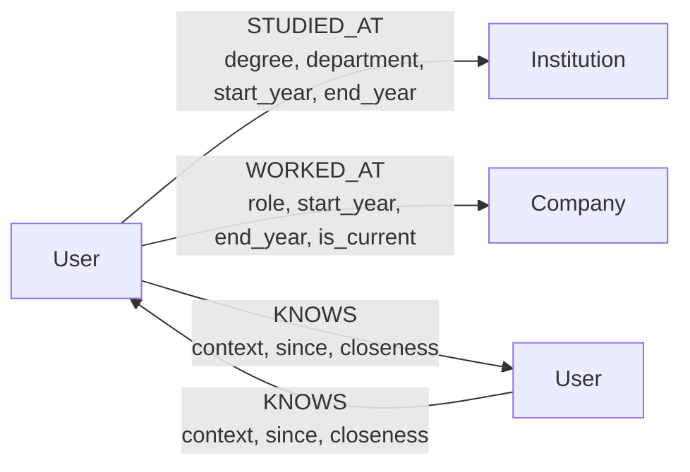

## **TODO**
> - [ ] Deploy backend + frontend, add live demo link (Section 11)
> - [ ] Record screen walkthrough, add link (Section 11)
> - [ ] Take and add screenshots (Section 10)
> - [ ] Double-check `.env` is in `.gitignore` and no credentials are committed anywhere in git history
> - [ ] Confirm CognoDB instance is still running (keep it alive until you hear back from Wexa)
> - [ ] Fix mypy and ruff lint issues
---

# PerNet

A graph-native professional networking API and frontend that lets users build a profile, connect with others, and traverse their real-world network to find the shortest path to any person or to employees at a given company.

---

## The Use Case

A new user signs up, receives an `httpOnly` JWT cookie, and is immediately authenticated. They then build their profile by adding education records (`POST /profile/education`) - each pointing to a shared `Institution` node - and employment records (`POST /profile/employment`) pointing to shared `Company` nodes. These shared nodes are the backbone of everything that follows.

Once the profile has some context, the dashboard surfaces connection suggestions (`GET /network/suggestions`): other users who attended the same university or worked at the same company, ranked by how many shared nodes they have in common. The user can connect with someone in one click (`POST /network/connect/{id}`), labelling the relationship with how they know them and how close the connection is. Connections are stored as bidirectional `KNOWS` edges so graph traversal works regardless of direction.

With a network in place, the user can search for any person by name, company, or location (`GET /network/users`) and then ask how to reach them (`GET /network/intro/{id}`). The intro finder returns the best available route in priority order: a direct shared context (you both worked at Acme), a `KNOWS` path of up to 7 hops with the full chain rendered as `Alice -> Charlie -> Bob`, a suggested bridge person who can make a warm introduction, or an explicit `unreachable` result if no route exists. All path results render as a readable text chain in the frontend - not an interactive graph view (see Known Limitations).

---

## Why a Graph Database?

### Shared Institution and Company nodes via MERGE

When a user adds an education or employment record, the backend runs:

```cypher
-- profile/queries.py: MERGE_INSTITUTION
MERGE (i:Institution {name: $name})
ON CREATE SET i.id = randomUUID(), i.type = $type
RETURN i

-- profile/queries.py: MERGE_COMPANY
MERGE (c:Company {name: $name})
ON CREATE SET c.id = randomUUID()
RETURN c
```

`MERGE` on `name` means two users who both list "MIT" as their university attach `STUDIED_AT` edges to the **same single node**, not two separate rows. In a relational schema you would have a `universities` lookup table and a `user_universities` junction table - the join topology is the same, but in a graph each `Institution` node is structurally part of the traversal path. This is what makes the suggestion query (below) a single pattern match rather than a multi-join.

### Shortest-path queries are natural in Cypher, awkward in SQL

```cypher
-- network/queries.py: FIND_SHORTEST_PATH
MATCH path = shortestPath(
    (me:User {id: $my_id})-[:KNOWS*..7]-(target:User {id: $target_id})
)
RETURN [n IN nodes(path) | {id: n.id, name: n.name}] AS chain, length(path) AS hops
```

`shortestPath()` with a variable-length pattern (`[:KNOWS*..7]`) finds the optimal path in a single pass using BFS. The depth bound (7 hops) is specified inline; there is no fixed schema depth. In SQL, the equivalent is a recursive CTE (`WITH RECURSIVE`) that must explicitly enumerate depth levels, or a series of self-joins - one per hop - where the maximum hop count must be hard-coded into the query structure. Neither approach is as readable, and both become significantly more expensive as the graph grows because SQL cannot exploit the graph's adjacency structure.

### "People you may know" requires multiple self-joins in SQL, one pattern in Cypher

```cypher
-- network/queries.py: GET_SUGGESTIONS
MATCH (me:User {id: $my_id})-[:STUDIED_AT|WORKED_AT]->(shared)<-[:STUDIED_AT|WORKED_AT]-(other:User)
WHERE other.id <> $my_id
WITH me, other,
     collect(DISTINCT shared.name) AS shared_context,
     count(DISTINCT shared)        AS overlap_score
WHERE COUNT { (me)-[:KNOWS]-(other) } = 0
RETURN other.id       AS id,
       other.name     AS name,
       other.location AS location,
       shared_context,
       overlap_score
ORDER BY overlap_score DESC
LIMIT 10
```

This traverses two relationship types in one direction and back, collects shared context, filters out existing connections with an inline subquery, and ranks by overlap count - all in a single pattern match. The equivalent relational query requires at least two self-joins across the `user_institutions` and `user_companies` junction tables, a `UNION` or `FULL OUTER JOIN` to combine them, a `NOT EXISTS` subquery to exclude existing connections, and a `GROUP BY` with a `COUNT`. The graph version is shorter, structurally matches the domain model, and scales better because traversal follows edges rather than scanning index ranges.

### Company search by network distance combines lookup and variable-length path in one traversal

The intro finder (`GET /network/intro/{id}`) includes this query:

```cypher
-- network/queries.py: FIND_INTRO_VIA_KNOWS
MATCH (target:User {id: $target_id})-[:WORKED_AT|STUDIED_AT]->(shared_node)
MATCH (shared_node)<-[:WORKED_AT|STUDIED_AT]-(bridge:User)
WHERE bridge.id <> $my_id AND bridge.id <> $target_id
MATCH my_path = shortestPath((me:User {id: $my_id})-[:KNOWS*..3]-(bridge))
WITH bridge, shared_node, length(my_path) AS knows_distance
MATCH target_path = shortestPath((bridge)-[:KNOWS*..5]-(target:User {id: $target_id}))
...
```

This combines: a node lookup (find the target), a one-hop traversal (find the target's shared context nodes), a reverse traversal (find bridge people at those nodes), and two independent variable-length shortest-path traversals. All in a single query, all in one round-trip. In SQL this would require at least four separate queries or a deeply nested CTE, and expressing the two `shortestPath` operations would require two separate recursive CTEs that cannot be naturally composed.

**Assignment requirement labels:**
- `GET_SUGGESTIONS` / `FIND_SHORTEST_PATH` satisfy **"at least one multi-hop traversal (2+ hops)"** - `shortestPath([:KNOWS*..7])` can return paths of 2 to 7 hops and is explicitly tested in the seed data (Alice -> Bob -> Ethan -> Ivan = 3 hops).
- `GET_SUGGESTIONS` satisfies **"at least one query a relational database would find awkward"** - the shared-context detection with inline `NOT EXISTS` and ranked overlap count across two relationship types in a single pattern match has no clean SQL equivalent at variable depth.

---

## Data Model

### Node labels and properties

**User**
- `id` - UUID (unique, indexed)
- `name` - display name
- `email` - lower-cased, unique
- `password_hash` - bcrypt hash, never returned by any endpoint
- `bio` - optional short description
- `location` - optional city/region
- `created_at` - ISO 8601 datetime

**Institution**
- `id` - UUID (unique)
- `name` - unique key used by `MERGE` (indexed)
- `type` - `university`, `school`, or `college`

**Company**
- `id` - UUID (unique)
- `name` - unique key used by `MERGE` (indexed)

### Relationships

| Relationship | Direction | Properties |
|---|---|---|
| `STUDIED_AT` | `(User)->(Institution)` | `degree`, `department`, `start_year`, `end_year` |
| `WORKED_AT` | `(User)->(Company)` | `role`, `start_year`, `end_year` (nullable), `is_current` |
| `KNOWS` | `(User)->(User)` bidirectional pair | `context` (`classmate`/`colleague`/`family`/`friend`), `since` (ISO date, nullable), `closeness` (`close`/`acquaintance`) |

`KNOWS` is always created as a matching pair in both directions (`a->b` and `b->a`) using `MERGE`, so it is idempotent and traversal works without specifying direction.

### Diagram



ASCII fallback:

```
(User) --[STUDIED_AT {degree, department, start_year, end_year}]--> (Institution)
(User) --[WORKED_AT  {role, start_year, end_year, is_current}]---> (Company)
(User) --[KNOWS {context, since, closeness}]--> (User)
(User) <-[KNOWS {context, since, closeness}]-- (User)   <- stored as a pair
```

---

## Tech Stack

- **FastAPI** (async) - REST API with automatic OpenAPI docs at `/docs`
- **Neo4j async driver** (`neo4j>=6.2`) - connects to CognoDB Cloud via Bolt; no ORM or OGM is used anywhere. Raw parameterised Cypher is a stated requirement of the assignment and the entire point: queries directly express the graph traversal logic without any abstraction layer translating between object and graph representations.
- **bcrypt** - password hashing (wraps the library directly to avoid the passlib/bcrypt 4.x incompatibility)
- **python-jose** - JWT signing and verification
- **pydantic-settings** - env-var config via `.env`, validated at startup
- **Next.js 16 / React 19 / TypeScript / Tailwind CSS 4** - frontend SPA, served on port 3000
- **Biome** - frontend linting and formatting (replaces ESLint/Prettier)

---

## Setup and Run

### 1. Create a CognoDB Cloud instance

Go to [https://console.cognodb.com/signup](https://console.cognodb.com/signup) to create a free account - no credit card required on the free tier. After creating an instance, copy the **Bolt URI**, **username**, and **password** shown on the instance screen. These are displayed once; store them now.

### 2. Clone and configure the backend

```bash
git clone <repo-url>
cd PerNet
```

Create a `.env` file in the project root (this file is listed in `.gitignore` - never commit it):

```dotenv
COGNODB_URI=bolt+s://<your-instance-host>:<port>
COGNODB_USER=<your-username>
COGNODB_PASSWORD=<your-password>
JWT_SECRET=<a-long-random-string>
JWT_ALGORITHM=HS256
JWT_TTL_MINUTES=60
```

See `.env.example` for reference. `JWT_SECRET` can be any long random string - it signs the session tokens.

### 3. Install backend dependencies

The project uses `uv` (a fast Python package manager). Install it if you don't have it:

```bash
pip install uv
```

Then install dependencies:

```bash
uv sync
```

### 4. Seed the database

This creates schema constraints, indexes, and populates sample users, institutions, companies, and relationships:

```bash
uv run python seed.py
```

To wipe any existing data first and seed from scratch:

```bash
uv run python seed.py --fresh
```

The seed data includes 35 users with a verified 3-hop path (Alice -> Bob -> Ethan -> Ivan). All seed users have password `Password123!`.

### 5. Start the backend

```bash
uv run uvicorn app.main:app --reload --port 8000
```

The API will be available at `http://localhost:8000`. Interactive docs: `http://localhost:8000/docs`.

### 6. Install and start the frontend

```bash
cd frontend
npm install
npm run dev
```

The frontend runs on **`http://localhost:3000`**. All requests to `/api/*` are automatically proxied to `http://localhost:8000` via the rewrite rule in `next.config.ts` - no `.env.local` file is required.

---

## Main Queries Explained

### `MERGE_INSTITUTION` and `MERGE_COMPANY` - find-or-create pattern

```cypher
-- profile/queries.py
MERGE (i:Institution {name: $name})
ON CREATE SET i.id = randomUUID(), i.type = $type
RETURN i

MERGE (c:Company {name: $name})
ON CREATE SET c.id = randomUUID()
RETURN c
```

Used by `POST /profile/education` and `POST /profile/employment`. `MERGE` on `name` ensures that two users listing the same institution or company attach to the same shared node rather than creating duplicates. This shared-node topology is what makes the suggestion and path queries work without any join logic.

---

### `GET_SUGGESTIONS` - shared-context detection without an explicit link

**Satisfies: "at least one multi-hop traversal (2+ hops)" and "at least one query a relational database would find awkward"**

```cypher
-- network/queries.py
MATCH (me:User {id: $my_id})-[:STUDIED_AT|WORKED_AT]->(shared)<-[:STUDIED_AT|WORKED_AT]-(other:User)
WHERE other.id <> $my_id
WITH me, other,
     collect(DISTINCT shared.name) AS shared_context,
     count(DISTINCT shared)        AS overlap_score
WHERE COUNT { (me)-[:KNOWS]-(other) } = 0
RETURN other.id       AS id,
       other.name     AS name,
       other.location AS location,
       shared_context,
       overlap_score
ORDER BY overlap_score DESC
LIMIT 10
```

Used by `GET /network/suggestions`. Finds users who share at least one Institution or Company with you but are not yet connected via `KNOWS`. Returns them ranked by the number of shared nodes (`overlap_score`). The `COUNT { ... }` subquery pattern excludes existing connections inline. This is a 2-hop traversal: `me -> shared_node <- other`.

---

### `FIND_SHORTEST_PATH` - the required multi-hop traversal

**Also satisfies: "at least one multi-hop traversal (2+ hops)"**

```cypher
-- network/queries.py
MATCH path = shortestPath(
    (me:User {id: $my_id})-[:KNOWS*..7]-(target:User {id: $target_id})
)
RETURN [n IN nodes(path) | {id: n.id, name: n.name}] AS chain, length(path) AS hops
```

Used by `GET /network/intro/{target_user_id}` as the primary path result when a `KNOWS` chain exists. Finds the shortest undirected path up to 7 hops. A close-connection variant (`FIND_CLOSE_PATH`) runs first and filters to paths where every hop has `closeness = 'close'`; the result falls back to `FIND_SHORTEST_PATH` if no all-close path exists. The full ordered chain is returned so the frontend can render `Alice -> Charlie -> Bob`.

---

### `FIND_INTRO_VIA_KNOWS` - combined lookup and variable-length path traversal

```cypher
-- network/queries.py
MATCH (target:User {id: $target_id})-[:WORKED_AT|STUDIED_AT]->(shared_node)
MATCH (shared_node)<-[:WORKED_AT|STUDIED_AT]-(bridge:User)
WHERE bridge.id <> $my_id AND bridge.id <> $target_id
MATCH my_path = shortestPath((me:User {id: $my_id})-[:KNOWS*..3]-(bridge))
WITH bridge, shared_node, length(my_path) AS knows_distance
MATCH target_path = shortestPath((bridge)-[:KNOWS*..5]-(target:User {id: $target_id}))
WITH bridge, shared_node, knows_distance,
     [n IN nodes(target_path) | {id: n.id, name: n.name}] AS chain_to_target,
     length(target_path) AS target_hops
ORDER BY knows_distance ASC, target_hops ASC
LIMIT 3
RETURN bridge.id              AS intro_id,
       bridge.name            AS intro_name,
       bridge.location        AS intro_location,
       shared_node.name       AS shared_node_name,
       labels(shared_node)[0] AS shared_node_type,
       knows_distance,
       'knows'                AS reach_type,
       chain_to_target
```

Used by `GET /network/intro/{target_user_id}` when no direct `KNOWS` path exists. Finds bridge people you know (within 3 hops via `KNOWS`) who share a company or institution with the target, then computes the onward `KNOWS` chain from each bridge to the target. Returns up to 3 candidates, ordered by how close they already are to you. This query combines institution/company lookups with two independent variable-length path traversals in a single query.

---

## API Reference

### Auth

| Method | Path | Auth required | Description |
|---|---|---|---|
| `POST` | `/auth/signup` | No | Register a new user; sets `access_token` cookie |
| `POST` | `/auth/login` | No | Authenticate with email and password; sets `access_token` cookie |

### Profile

| Method | Path | Auth required | Description |
|---|---|---|---|
| `GET` | `/profile/me` | Yes | Get own profile and connection count |
| `PATCH` | `/profile/me` | Yes | Update `name`, `bio`, `location` (partial update) |
| `DELETE` | `/profile/me` | Yes | Delete account and all attached relationships (irreversible) |
| `POST` | `/profile/education` | Yes | Add a `STUDIED_AT` record; creates Institution node if new |
| `GET` | `/profile/education` | Yes | List all education records, ordered by `start_year` desc |
| `PATCH` | `/profile/education/{institution_name}/{start_year}` | Yes | Update `degree`, `department`, or `end_year` on a record |
| `DELETE` | `/profile/education/{institution_name}/{start_year}` | Yes | Remove a `STUDIED_AT` relationship |
| `POST` | `/profile/employment` | Yes | Add a `WORKED_AT` record; creates Company node if new |
| `GET` | `/profile/employment` | Yes | List all employment records, ordered by `start_year` desc |
| `PATCH` | `/profile/employment/{company_name}/{start_year}` | Yes | Update `role`, `end_year`, or `is_current` on a record |
| `DELETE` | `/profile/employment/{company_name}/{start_year}` | Yes | Remove a `WORKED_AT` relationship |

### Network

| Method | Path | Auth required | Description |
|---|---|---|---|
| `GET` | `/network/users` | Yes | Search people by name with optional `location`, `company`, `institution` filters |
| `POST` | `/network/connect/{target_user_id}` | Yes | Create bidirectional `KNOWS` relationship |
| `GET` | `/network/connections` | Yes | List all direct connections |
| `PATCH` | `/network/connect/{target_user_id}` | Yes | Update `context`, `since`, or `closeness` on an existing connection |
| `DELETE` | `/network/connect/{target_user_id}` | Yes | Remove a connection (both directions) |
| `GET` | `/network/suggestions` | Yes | Get up to 10 suggestions ranked by shared Institution/Company overlap |
| `GET` | `/network/intro/{target_user_id}` | Yes | Find best route to reach someone (shared context, KNOWS path, bridge person, or unreachable) |

Authentication is cookie-based. `POST /auth/signup` and `POST /auth/login` set an `httpOnly`, `SameSite=Lax` cookie named `access_token` containing a signed JWT. All other endpoints read that cookie automatically - no `Authorization` header is needed.

---

## Project Structure

```
PerNet/
├── app/                         # FastAPI backend
│   ├── main.py                  # App factory, CORS, lifespan, schema DDL
│   ├── config.py                # Env-var config via pydantic-settings
│   ├── database.py              # Async Neo4j driver, run_query(), handle_db_errors decorator
│   ├── dependencies.py          # get_current_user() FastAPI dependency (JWT -> User node)
│   ├── auth/
│   │   ├── router.py            # POST /auth/signup, POST /auth/login
│   │   ├── queries.py           # CREATE_USER, GET_USER_BY_EMAIL, GET_USER_BY_ID
│   │   └── schemas.py           # SignupRequest, LoginRequest, TokenResponse
│   ├── profile/
│   │   ├── router.py            # Full CRUD for profile, education, employment
│   │   ├── queries.py           # All profile Cypher (MERGE_INSTITUTION, MERGE_COMPANY, etc.)
│   │   └── schemas.py           # ProfileResponse, EducationRequest, EmploymentRequest, etc.
│   ├── network/
│   │   ├── router.py            # Search, connect, suggestions, intro finder
│   │   ├── queries.py           # All network Cypher (GET_SUGGESTIONS, FIND_SHORTEST_PATH, etc.)
│   │   └── schemas.py           # ConnectRequest, SuggestionItem, IntroResponse, etc.
│   ├── schemas/
│   │   └── common.py            # Shared response schemas (MessageResponse)
│   └── test/
│       ├── test_auth.py         # Auth endpoint tests
│       └── test_database_connection.py  # DB connectivity test
├── seed.py                      # Database seeding utility (constraints, sample data, KNOWS graph)
├── pyproject.toml               # Python dependencies and project metadata
├── .env.example                 # Template for required environment variables
├── frontend/
│   ├── app/
│   │   ├── (auth)/              # Login and signup pages (unauthenticated layout)
│   │   │   ├── login/page.tsx
│   │   │   └── signup/page.tsx
│   │   └── (app)/               # Authenticated app pages (with Navbar)
│   │       ├── dashboard/page.tsx      # Profile card + suggestions
│   │       ├── people/page.tsx         # People search
│   │       ├── connections/page.tsx    # Direct connections list
│   │       └── profile/
│   │           ├── me/page.tsx         # View own profile
│   │           └── edit/page.tsx       # Edit profile, education, employment
│   ├── components/
│   │   ├── dashboard/           # ProfileCard, SearchBar, SuggestionCard
│   │   ├── people/              # PersonCard
│   │   ├── profile/             # EducationForm, EducationList, EmploymentForm, EmploymentList, ProfileUpdateForm
│   │   ├── search/              # PathResult (renders KNOWS chain as text)
│   │   └── ui/                  # ErrorBanner, FieldError, Navbar, SkeletonCard, Spinner, SuccessBanner
│   ├── hooks/                   # useDashboardData, usePeopleSearch, useProfileData
│   ├── types/                   # api.ts, network.ts, profile.ts - TypeScript type definitions
│   ├── utils/                   # parseErrors.ts, validation.ts
│   ├── next.config.ts           # Proxies /api/* -> http://localhost:8000/*
│   └── package.json             # Next.js, React, TypeScript, Tailwind, Biome
```

---

## Screenshots

<!-- TODO: add screenshot -->
### Signup / Login
`TODO: screenshot-signup.png`

<!-- TODO: add screenshot -->
### Dashboard / Suggestions
`TODO: screenshot-dashboard.png`

<!-- TODO: add screenshot -->
### Search - Find path to a person
`TODO: screenshot-search-path.png`

<!-- TODO: add screenshot -->
### Search - Find people at a company
`TODO: screenshot-search-company.png`

---

## Live Demo

TODO: hosted demo URL (deploy backend + frontend, then paste link here)

## Screen Recording

TODO: link to screen recording (Loom, YouTube unlisted, or similar) walking through signup -> profile build -> search

---

## Deployment Guide

### Backend - Render

A `render.yaml` at the repo root defines the service. Render will pick it up automatically on first deploy.

**Steps:**
1. Push the repo to GitHub
2. In the [Render dashboard](https://render.com), click **New -> Blueprint** and connect the repo - it reads `render.yaml` automatically
3. In the Render dashboard, open the service's **Environment** tab and fill in the four secret values (marked `sync: false` in `render.yaml` so they are never stored in the file):

| Variable | Value |
|---|---|
| `COGNODB_URI` | Your CognoDB Cloud Bolt URI, e.g. `bolt+s://abc.databases.neo4j.io:7687` |
| `COGNODB_USER` | CognoDB username |
| `COGNODB_PASSWORD` | CognoDB password |
| `JWT_SECRET` | Long random string - generate with: `python -c "import secrets; print(secrets.token_hex(32))"` |
| `FRONTEND_URL` | Your Vercel frontend URL - set this after the frontend is deployed (step below) |

`ENVIRONMENT=production`, `JWT_ALGORITHM=HS256`, and `JWT_TTL_MINUTES=60` are already set as non-secret defaults in `render.yaml`.

`ENVIRONMENT=production` automatically:
- Sets `secure=True` on the `access_token` cookie (required for HTTPS)
- Restricts CORS to `FRONTEND_URL` only

The build command (`pip install uv && uv sync --no-dev`) and start command (`uvicorn app.main:app --host 0.0.0.0 --port $PORT`) are already defined in `render.yaml`.

### Frontend - Vercel

A `vercel.json` inside `frontend/` configures the build. The repo root contains the backend; tell Vercel to look in `frontend/`.

**Steps:**
1. In the [Vercel dashboard](https://vercel.com), click **Add New -> Project** and import the repo
2. Set **Root Directory** to `frontend`
3. Add one environment variable:

| Variable | Value |
|---|---|
| `NEXT_PUBLIC_API_URL` | Your Render backend URL, e.g. `https://pernet-api.onrender.com` |

4. Deploy. Copy the resulting Vercel URL (e.g. `https://pernet.vercel.app`) and paste it into the `FRONTEND_URL` env var in the Render dashboard, then redeploy the backend.

### Cookie / CORS wiring

The frontend calls the backend exclusively through `/api/*` rewrites defined in `next.config.ts`. From the browser's perspective all requests are same-origin, so `SameSite=Lax` cookies are sent automatically with no extra work. The backend's `FRONTEND_URL` is used only for the `Access-Control-Allow-Origin` CORS header - it must exactly match the Vercel URL with no trailing slash.

---

## Error Handling and Engineering Notes

**Environment-variable config:** All secrets and connection details live in `.env`, which is loaded by `pydantic-settings` at startup and validated before the server accepts any traffic. `.env` is listed in `.gitignore` and is never committed.

**`handle_db_errors` decorator:** Every route handler in all three routers is decorated with `@handle_db_errors("context_name")` (defined in `app/database.py`). This catches `neo4j.exceptions.ServiceUnavailable` and `AuthError` and converts them to `HTTP 503` responses with a stable error message. The application never crashes with an unhandled database exception; callers can safely retry on 503.

**Parameterised queries throughout:** No Cypher query in the codebase concatenates user input into a query string. Every value is passed via the `$paramName` syntax using the driver's parameterised query API. All Cypher is isolated in `queries.py` files - none appears in router or schema files.

---

## Known Limitations and Future Work

- **No request/accept flow for connections.** Connecting with someone is a one-click action with no pending state. This was a deliberate scope decision for the available timeframe - the graph model supports it (a `PENDING` relationship type would work), but the product flow was not built out.

- **No `Activity` or extracurricular node type.** An earlier design included an `Activity` label for clubs, projects, and other non-institutional affiliations. This was cut from scope; the final model has three node types: `User`, `Institution`, `Company`.

- **No interactive graph visualisation.** Path results (from `GET /network/intro/{id}`) render as a readable text chain (`Alice -> Charlie -> Bob`) in the `PathResult` component. A library like Cytoscape.js or D3-force would enable an interactive graph view; that was considered out of scope.

- **Auth and graph data share one datastore.** User nodes (including hashed passwords) live in CognoDB alongside the social graph. This is a single-datastore architecture that is appropriate at this scale and simplifies deployment significantly. In a production system at scale, you would typically extract auth to a dedicated relational store (PostgreSQL with a users table) and keep the graph database for relationship data only - the standard polyglot-persistence pattern.
